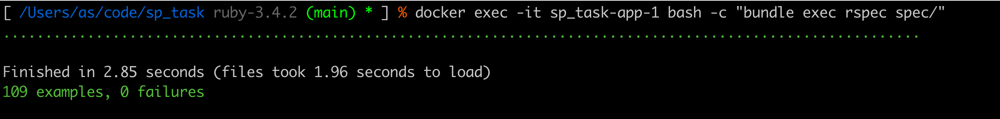

# README

## Short Description

Build a small service that reads the JSON, calculates shipping rates based on exchange rates (always EUR-based, selected by sailing's departure date), and outputs the best shipping option according to the input criteria (cheapest-direct, cheapest, or fastest). [Full task description](README_before_task.md)

## Quick setup and run

Project is published in GitHub https://github.com/astikans/sp_task

### Prerequisites
- Git
- Docker and Docker Compose

### Usage
When running the main.rb file, you'll be prompted to:
1. Enter an origin port code (e.g., CNSHA for Shanghai)
2. Enter a destination port code (e.g., BRSSZ for Santos)
3. Choose a search criteria (cheapest, cheapest-direct, or fastest)

The system will then calculate and display the optimal route based on your criteria.

### Run
1) Clone the repository: `git clone git@github.com:astikans/sp_task.git && cd sp_task`
2) Start the application and seed data from response.json: `docker-compose up -d`
3) Run the main program: `docker exec -it sp_task-app-1 bash -c "bundle exec ruby main.rb"`

### Additional commands
- View application logs: `docker-compose logs -f`
- Stop the application: `docker-compose down`
- Seed the database with input data from response.json: `docker exec -it sp_task-app-1 bash -c "bundle exec rake db:seed"`
- Reset the database: `docker exec -it sp_task-app-1 bash -c "bundle exec rake db:truncate_all"`

## Demo


## Tests

Run tests: `docker exec -it sp_task-app-1 bash -c "bundle exec rspec spec"`



## Structure

The project was implemented as a Ruby on Rails API-only application with PostgreSQL database. This approach was chosen to:

1. Create a clean, structured codebase with clear separation of concerns
2. Leverage Rails' robust model validation and database management capabilities
3. Split responsibilities between data validation/loading and route calculation logic
4. Provide a foundation for potential future API endpoints while keeping the current CLI interface

The system follows a service-oriented architecture where main.rb serves as the entry point, validating user input and providing answers based on the processed data in the system. The database structure supports efficient querying of shipping routes and rates.

### Optimal path finder

The `RoutePlanner` service implements a flexible, graph-based pathfinding algorithm with the following key features:

- **Generalized Implementation**: Works with any objects that meet specific interface requirements
- **Customizable Cost Functions**: Supports different optimization criteria through configurable cost methods
- **Time-Aware Routing**: Handles temporal constraints for connecting routes
- **Flexible API**: Can be adapted to various routing problems beyond shipping

#### How RoutePlanner Works
 - Takes collections of objects (sailings), start and end points, earliest start date, and a mapping of methods
 - The mapping allows the planner to work with different object types by specifying which methods to use for costs, points, and dates

**Algorithm**
   - Uses a priority queue to explore possible paths in order of increasing cost
   - Maintains a visited set to avoid redundant exploration
   - For each node, explores all temporally valid connections (sailings that depart after previous arrival)
   - Updates the best path whenever a lower-cost path to the destination is found

This implementation allows the system to efficiently find optimal routes through complex shipping networks while handling various optimization criteria and constraints.

### Database
The project uses PostgreSQL with the following tables:
- **Ports** - Contains port codes (e.g., ESBCN, NLRTM)
- **Exchange Rates** - Daily currency exchange rates stored in JSON format
- **Sailing Rates** - Contains shipping rates with codes and currency information
- **Sailings** - Represents shipping routes between ports with departure/arrival dates and costs

### Services
- **RoutePlanner** - Plans optimal routes between ports
- **DataImporter** - Imports data from JSON files into the database
- **Search** - Contains specialized search strategies:
  - Cheapest - Finds the cheapest route regardless of time
  - CheapestDirect - Finds cheapest direct route
  - Fastest - Finds the fastest route between ports

### Additional things (gems)

- **Annotate** - Added to automatically generate schema information in model files, enhancing code readability and providing quick reference to database structure directly in the model classes.
- **Database Consistency** - Ensures database schema and model validations stay in sync, preventing data integrity issues by validating consistency between database constraints and application-level validations.
- **Shoulda Matchers** - Provides simple one-liner tests for common Rails functionality, making model validation and association tests more concise and readable.
- **Awesome Print** - Enhances debugging by providing pretty printing of Ruby objects with syntax highlighting and indentation, making complex data structures easier to inspect.

### Code structure

```
sp_task/
├── app/
│   ├── models/             # Database models
│   │   ├── port.rb         # Port model
│   │   ├── sailing.rb      # Sailing model
│   │   ├── sailing_rate.rb # Sailing rate model
│   │   └── exchange_rate.rb # Exchange rate model
│   ├── services/           # Business logic services
│   │   ├── data_importer.rb  # Imports JSON data to database
│   │   ├── route_planner.rb  # Plans optimal routes between ports
│   │   ├── error_handler/   # Error handling services
│   │   │   ├── wrapper.rb   # Wraps operations with error handling
│   │   │   └── raised_error.rb # Custom error handling implementation
│   │   ├── formatters/      # Output formatting services
│   │   │   └── sailings.rb  # Formats sailing data for display
│   │   ├── inputs/          # Input processing services
│   │   │   ├── base.rb      # Base input processing class
│   │   │   ├── criteria.rb  # Processes search criteria input
│   │   │   └── port.rb      # Processes port code input
│   │   ├── input_validators/ # Input validation services
│   │   │   ├── base.rb      # Base validator class
│   │   │   ├── criteria.rb  # Validates search criteria
│   │   │   └── port.rb      # Validates port codes
│   │   ├── readers/         # Data reading services
│   │   │   └── json_file_reader.rb # Reads and parses JSON files
│   │   └── search/          # Search strategy implementations
│   │       ├── base.rb      # Base search strategy class
│   │       ├── cheapest.rb  # Finds cheapest route regardless of time
│   │       ├── cheapest_direct.rb # Finds cheapest direct route
│   │       ├── fastest.rb   # Finds fastest route regardless of cost
│   │       └── route_search.rb # Route search orchestration
├── config/                  # Application configuration
├── db/                      # Database related files
│   ├── migrate/             # Database migrations
│   │   ├── create_ports.rb
│   │   ├── create_sailings.rb
│   │   ├── create_sailing_rates.rb
│   │   └── create_exchange_rates.rb
│   ├── schema.rb            # Database schema
│   └── seeds.rb             # Database seed script
├── main.rb                  # CLI application entry point
├── spec/                    # RSpec tests
│   ├── factories/           # Test data factories using FactoryBot
│   │   ├── ports.rb         # Port factory definitions
│   │   ├── sailings.rb      # Sailing factory definitions
│   │   ├── sailing_rates.rb # Sailing rate factory definitions
│   │   └── exchange_rates.rb # Exchange rate factory definitions
│   ├── models/              # Model tests
│   │   ├── port_spec.rb     # Port model tests
│   │   ├── sailing_spec.rb  # Sailing model tests
│   │   ├── sailing_rate_spec.rb # Sailing rate model tests
│   │   └── exchange_rate_spec.rb # Exchange rate model tests
│   ├── services/            # Service tests
│   │   ├── data_importer_spec.rb  # Data importer tests
│   │   ├── route_planner_spec.rb  # Route planner tests
│   │   ├── error_handler/   # Error handling service tests
│   │   ├── formatters/      # Formatter tests
│   │   ├── inputs/          # Input processing tests
│   │   ├── input_validators/ # Input validation tests
│   │   ├── readers/         # Data reader tests
│   │   └── search/          # Search strategy tests
│   │       ├── cheapest_spec.rb     # Cheapest route strategy tests
│   │       ├── cheapest_direct_spec.rb # Direct route strategy tests
│   │       └── fastest_spec.rb      # Fastest route strategy tests
│   ├── main_spec.rb         # Tests for the CLI entry point
│   ├── rails_helper.rb      # Rails-specific test configuration
│   └── spec_helper.rb       # General RSpec configuration
├── Dockerfile.dev           # Docker configuration for production
├── docker-compose.yml       # Docker Compose configuration
├── Gemfile                  # Ruby dependencies
├── Gemfile.lock             # Locked Ruby dependencies
├── response.json            # Sample data
└── README.md                # Project documentation
```

## Conclusion

This project demonstrates a solution for optimizing shipping routes based on multiple criteria (cheapest, cheapest-direct, fastest). Built with Ruby on Rails and PostgreSQL, it implements a flexible graph-based routing algorithm that handles complex shipping networks effectively. The service architecture provides clear separation of concerns, making the codebase maintainable and extensible. The system converts all rates to EUR based on exchange rates specific to sailing dates, ensuring accurate cost calculations across different currencies.

## About me

With years of experience in Ruby on Rails, cloud architectures, and AI-driven automation, I help businesses streamline workflows, enhance security, and build scalable systems that deliver real results.

### Contact Information
- **Name:** Andris Stikans
- **Email:** andris.stikans@gmail.com
- **Phone:** +371 28666366
- **Address:** Sigulda, Latvia
- **LinkedIn:** [linkedin.com/in/andris-stikans](https://www.linkedin.com/in/andris-stikans)
- **Portfolio:** [andris.stikans.taurus.lv](https://andris.stikans.taurus.lv/)

